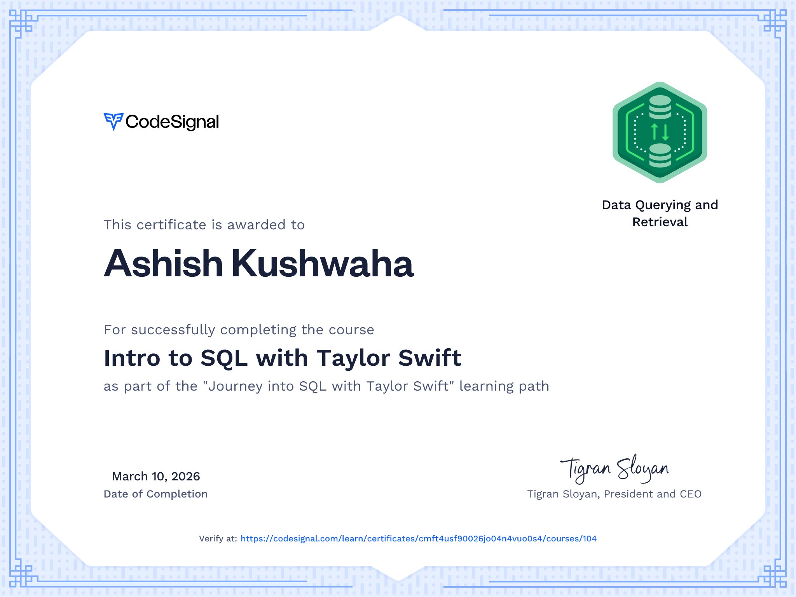

# 🎵 Intro to SQL with Taylor Swift – CodeSignal


---

## 📖 About This Repository

This repository documents my learning journey through the **"Intro to SQL with Taylor Swift"** course on CodeSignal.

As a **huge Taylor Swift fan**, this course was the perfect motivation for me to start learning SQL. Practicing database queries using a dataset inspired by her music made the learning experience much more fun and engaging.

While this course focuses on **SQL fundamentals**, it helped me understand how databases work and how to retrieve and analyze data using queries.

This repository contains my **SQL practice queries, notes, and exercises** from the course.

---

## 🚀 What I Learned

Through this course I practiced the core SQL concepts:

* `SELECT` statements
* Filtering data with `WHERE`
* Sorting results using `ORDER BY`
* Aggregate functions (`COUNT`, `AVG`, `MAX`, `MIN`)
* `GROUP BY` for summarizing data
* `JOIN` operations for combining tables

This course focuses on **SQL basics**, but it gave me a solid foundation in querying relational databases.

---

## 📂 Repository Structure

```
codesignal-sql-taylor-swift
│
├── README.md
│
├── schema/
│   └── database_schema.sql
│
├── data/
│   └── taylor_swift_data.sql
│
├── lessons/
│   ├── 01_select_basics.sql
│   ├── 02_where_filtering.sql
│   ├── 03_order_by.sql
│   ├── 04_aggregate_functions.sql
│   ├── 05_group_by.sql
│   └── 06_joins.sql
│
└── notes/
    └── sql_notes.md
```

---

## 🎓 Certificate

I completed the **Intro to SQL with Taylor Swift** course on CodeSignal.




---

## 🎯 Goal of This Repository

* Document my SQL learning journey
* Practice SQL queries
* Build a small SQL practice project for my GitHub portfolio

---

## 💡 Final Thoughts

I originally enrolled in this course because I’m a **big Taylor Swift fan**, but it turned out to be a great introduction to SQL.

I may not know **advanced SQL yet**, but I now feel comfortable with **the fundamentals of querying databases**, and this is just the beginning of my database learning journey.

---

⭐ If you're also a Taylor Swift fan learning SQL, you’ll probably enjoy this course as much as I did.
